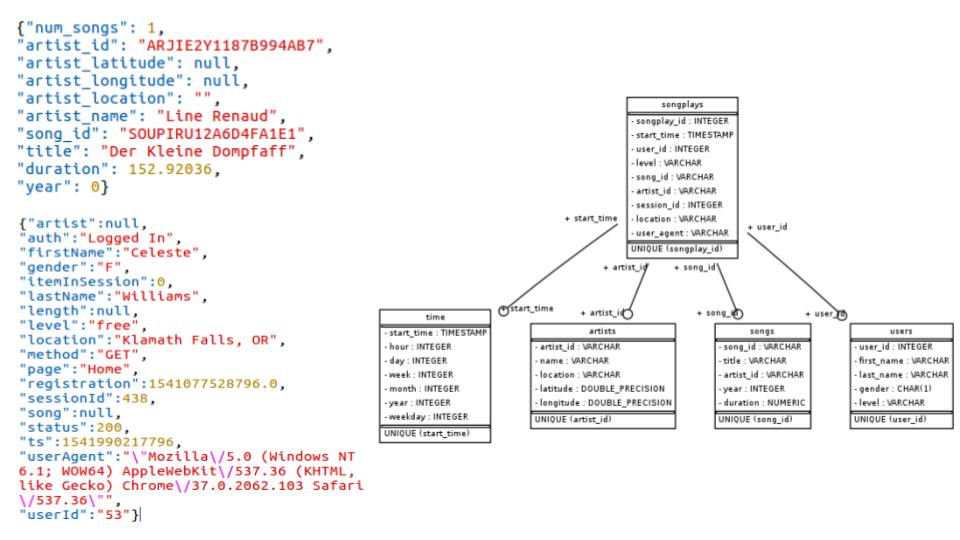
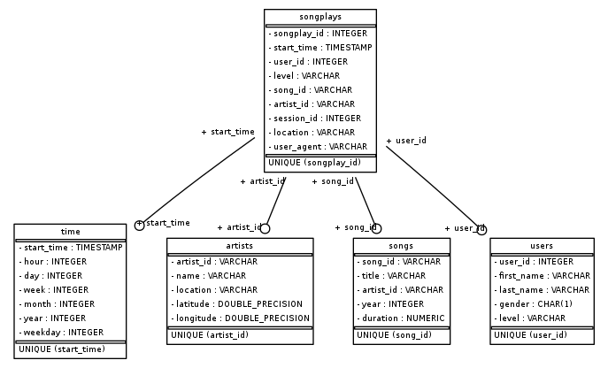

# Summary

- Sparkify startup requested to analyze user activities using song and user data. 
- The project optimizes queries on song play analysis.
- It creates database schema and the Extract, Transform and Load (ETL) pipeline.



# Data
Data for song and user activities is in two directories _data/log_data_ and _data/song_data_ as JSON files.

## song_data 
- subset of real data from the [Million Song Dataset](http://millionsongdataset.com/).
- each file is in JSON format 
- contains metadata about a song and the artist of that song. 
- files are partitioned by the first three letters of each song's track ID. 
- example of file paths to two files in song dataset.

```
song_data/A/B/C/TRABCEI128F424C983.json
song_data/A/A/B/TRAABJL12903CDCF1A.json
```

- example of single song file, TRAABJL12903CDCF1A.json:

```
{
    "num_songs": 1, 
    "artist_id": "ARJIE2Y1187B994AB7", 
    "artist_latitude": null, 
    "artist_longitude": null, 
    "artist_location": "", 
    "artist_name": "Line Renaud", 
    "song_id": "SOUPIRU12A6D4FA1E1", 
    "title": "Der Kleine Dompfaff", 
    "duration": 152.92036, 
    "year": 0
}
```

## log_data 
- log files in JSON format generated by [event simulator](https://github.com/Interana/eventsim) based on the songs in the song dataset.
- these simulate activity logs from a music streaming app based on specified configurations.
- log files are partitioned by year and month. 
- example, here are filepaths to two files in log dataset.

```
log_data/2018/11/2018-11-12-events.json
log_data/2018/11/2018-11-13-events.json
```
- example of single log file, 2018-11-12-events.json:

```
{
    "artist":null,
    "auth":"Logged In",
    "firstName":"Celeste",
    "gender":"F",
    "itemInSession":0,
    "lastName":"Williams",
    "length":null,
    "level":"free",
    "location":"Klamath Falls, OR",
    "method":"GET",
    "page":"Home",
    "registration":1541077528796.0,
    "sessionId":438,
    "song":null,
    "status":200,
    "ts":1541990217796,
    "userAgent":"\"Mozilla\/5.0 (Windows NT 6.1; WOW64) AppleWebKit\/537.36 (KHTML, like Gecko) Chrome\/37.0.2062.103 Safari\/537.36\"",
    "userId":"53"
}
```

# Data model


>Relational database model with star schema that contains 1 fact table (**songplays**) and 4 dimension tables (**users**, **songs**, **artists** and **time**)

## Fact Table

### songplays
- records in log data associated with song plays i.e. records with page: 'NextSong'

| Column | Type | Nullable|
| ------ | ----- | --------- |
| songplay_id (PK)| SERIAL| NOT NULL |
| start_time| timestamp| NOT NULL |
| user_id| int| NOT NULL |
| level| varchar| |
| song_id| varchar| |
| artist_id| varchar| |
| session_id| int| |
| location| varchar| |
| user_agent| varchar| |

## Dimension Tables

### users
- users in the app

| Column | Type | Nullable|
| ------ | ----- | --------- |
| user_id (PK)| int| NOT NULL |
| first_name| varchar||
| last_name| varchar||
| gender| char(1)| |
| level| varchar| |

### songs 
- songs in music database

| Column | Type | Nullable|
| ------ | ----- | --------- |
| song_id (PK)| varchar| NOT NULL |
| title| varchar| NOT NULL |
| artist_id| varchar| NOT NULL |
| year| int| |
| duration| numeric| NOT NULL |

### artists
- artists in music database

| Column | Type | Nullable|
| ------ | ----- | --------- |
| artist_id (PK)| varchar| NOT NULL |
| name| varchar| NOT NULL |
| location| varchar| |
| latitude| float| |
| longitude| float| |

### time 
- timestamps of records in songplays broken down into specific units

| Column | Type | Nullable|
| ------ | ----- | --------- |
| start_time (PK)| timestamp| NOT NULL |
| hour| int| |
| day| int| |
| week| int| |
| month| int| |
| year| int| |
| weekday| int| |
    
# Project files

## sql_queries.py
- contains all the sql queries

## create_tables.py 
- drops and creates the tables. 
- run this file to reset the tables before each time you run the ETL scripts.

## etl.ipynb 
- reads and processes a single file from song_data and log_data 
- loads the data into tables. 
- contains detailed instructions on the ETL process for each of the tables.

## test.ipynb 
- displays the first few rows of each table to check the database.

## etl.py 
- reads and processes files from song_data and log_data 
- loads data into the tables.

# How to run the scripts:

- open terminal

- run _create_tables.py_ to drop and create tables:

>    ``
    python create_tables.py
    ``

- run _etl.py_ to process files and load data:

>    ``
    python etl.py
    ``
# Data Engineering projects

- ## [Data Modeling with Postgres](https://github.com/aymanibrahim/data-modeling-postgres)
- ## [Data Modeling with Cassandra](https://github.com/aymanibrahim/data-modeling-cassandra)    